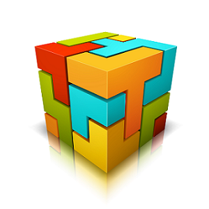

#HSLIDE
## Речници, структури и протоколи


#HSLIDE
## Речници


#HSLIDE
### Създаване и достъп до Map
```elixir
iex> %{}
%{}

iex> %{name: "Пешо"}
%{name: "Пешо"}
```

#HSLIDE
* Map с ключове атоми:

```elixir
pesho = %{
  name: "Пешо",
  age: 35,
  hobbies: {:drink, :smoke, :xxx, :eurofootball},
  job: "шлосер"
}
```

#HSLIDE
* Четене на стойности
```elixir
iex> pesho[:name]
"Пешо"
iex> pesho.name
"Пешо"
iex> Map.fetch(pesho, :name)
{:ok, "Пешо"}
iex> Map.fetch!(pesho, :name)
"Пешо"
iex> Map.get(pesho, :name)
"Пешо"
```

#HSLIDE
```elixir
iex> pesho[:full_name]
nil
iex> pesho.full_name
** (KeyError) key :full_name not found
iex> Map.fetch(pesho, :full_name)
:error
iex> Map.fetch!(pesho, :full_name)
** (KeyError) key :full_name not found
```

#HSLIDE
```elixir
iex> Map.get(pesho, :full_name)
nil
iex> Map.get(pesho, :full_name, "Петър Петров")
"Петър Петров"

iex> Map.get_lazy(pesho, :full_name, fn -> "Петър Петров" end)
"Петър Петров"
```

#HSLIDE
* Ако ключовете не са `atom`-и, синтаксиса е малко по-различен:

```elixir
pesho = %{
  "name" => "Пешо",
  "age" => 35,
  "hobbies" => {:drink, :smoke, :xxx, :eurofootball},
  "job" => "шлосер"
}
```

#HSLIDE
```elixir
iex> pesho["age"]
35
iex> pesho.age
** (KeyError) key :age not found
iex> pesho."age"
** (KeyError) key :age not found
```

#HSLIDE
### Промяна на Map
```elixir
iex> Map.pop(pesho, :name)
{"Пешо", %{
    age: 35,
    hobbies: {:drink, :smoke, :xxx, :eurofootball},
    job: "шлосер"
  }
}
iex> Map.pop(pesho, :full_name, "Петър Панов")
{"Петър Панов", %{...}}
iex> Map.pop_lazy(pesho, :nick, fn -> "PI4A" end)
{"PI4A", %{...}}
```

#HSLIDE
```elixir
iex> Map.delete(pesho, :name)
%{
  age: 35,
  hobbies: {:drink, :smoke, :xxx, :eurofootball},
  job: "шлосер"
}
iex> Map.delete(pesho, :full_name)
%{
  age: 35,
  hobbies: {:drink, :smoke, :xxx, :eurofootball},
  job: "шлосер",
  name: "Пешо"
}
```

#HSLIDE
```elixir
iex> Map.drop(pesho, [:hobbies, :job])
%{age: 35, name: "Пешо"}
```

#HSLIDE
```elixir
pesho = %{
  name: "Пешо",
  age: 35,
  hobbies: {:drink, :smoke, :xxx, :eurofootball},
  job: "шлосер"
}

iex> %{pesho | hobbies: :none}
%{age: 35, hobbies: :none, job: "шлосер", name: "Пешо"}

iex> %{pesho | drink: :rakia}
** (KeyError) key :drink not found in:
```

#HSLIDE
```elixir
iex> Map.merge(pesho, %{hobbies: :just_drinking, dring: :rakia})
%{age: 35, dring: :rakia, hobbies: :just_drinking, job: "шлосер",
  name: "Пешо"}
```

#HSLIDE
### Речници и съпоставяне на образци


#HSLIDE
```elixir
iex> pesho = %{
  age: 35, dring: :rakia, hobbies: :just_drinking, name: "Пешо"
}
%{age: 35, dring: :rakia, hobbies: :just_drinking, name: "Пешо"}

iex> %{name: x} = pesho
%{age: 35, dring: :rakia, hobbies: :just_drinking, name: "Пешо"}
iex> x
"Пешо"
```

#HSLIDE
```elixir
iex> %{name: _, age: _} = pesho
%{age: 35, dring: :rakia, hobbies: :just_drinking, name: "Пешо"}
iex> %{name: _, age: _, sex: _} = pesho
** (MatchError)
```

#HSLIDE
```elixir
defmodule A do
  def f(%{name: name} = person) do
    IO.puts(name)
    person
  end
end

iex> A.f(pesho)
Пешо
%{age: 35, dring: :rakia, hobbies: :just_drinking, name: "Пешо"}
```

#HSLIDE
### Операции върху вложени речници

#HSLIDE
```elixir
data = %{
  proboscidea: %{
    elephantidae: %{
      elephas: [
        "Asian Elephant", "Indian Elephant",
        "Sri Lankan Elephant"
      ],
      loxodonta: [
        "African bush elephant",
        "African forest elephant"
      ]
    },
    mammutidae: %{ mammut: ["Mastodon"] }
  }
}
```

#HSLIDE
```elixir
iex> put_in(
  data, [:proboscidea, :elephantidae, :fictional], ["Jumbo"]
)
```

#HSLIDE
```elixir
%{
  proboscidea: %{
    elephantidae: %{
      elephas: [
        "Asian Elephant", "Indian Elephant",
        "Sri Lankan Elephant"
      ],
      fictional: ["Jumbo"],
      loxodonta: [
        "African bush elephant", "African forest elephant"
      ]
    },
    mammutidae: %{ mammut: ["Mastodon"] }
  }
}
```

#HSLIDE
```elixir
iex> put_in(data.proboscidea.elephantidae.fictional, ["Jumbo"])
```

#HSLIDE
```elixir
iex> get_in(data, [:proboscidea, :elephantidae, :loxodonta])
["African bush elephant", "African forest elephant"]
```

#HSLIDE
## Структури


#HSLIDE
Структурите всъщност са речници, ограничени по няколко признака:
1. Ключовете им са атоми. Задължително атоми.
2. Ключовете им са предефинирани.
3. Много свойства на речниците не са валидни за структури.

#HSLIDE
* Структурите се дефинират в модул. Името на модула е името на структурата:

```elixir
defmodule Person do
  defstruct [:name, :age, location: "Far away", chldren: []]
end
```

#HSLIDE
* Създаваме инстанция на структурата, подобно на какво създаваме `map`-ове:

```elixir
iex> pesho = %Person{
  name: "Пешо", age: 35, location: "Горен Чвор"
}
%Person{
  age: 35, chldren: [], location: "Горен Чвор", name: "Пешо"
}
```

#HSLIDE
```elixir
iex> inspect pesho, structs: false
"%{
  __struct__: Person,
  age: 35,
  chldren: [],
  location: \"Горен Чвор\", name: \"Пешо\"
}"
```

#HSLIDE
* Хубава новина е, че `Map` модулът работи със структури:

```elixir
iex> Map.put(pesho, :name, "Стойчо")
%Person{
  age: 35, chldren: [], location: "Горен Чвор", name: "Стойчо"
}
```

#HSLIDE
* Операторът за обновяване също работи:

```elixir
iex> %{pesho | name: "Стойчо"}
%Person{
  age: 35, chldren: [], location: "Горен Чвор", name: "Стойчо"
}
```

#HSLIDE
```elixir
iex> is_map(pesho)
true
iex> is_map(%{"key" => "value"})
true

iex> map_size(pesho)
5
iex> map_size(%{"ключ" => "стойност"})
1
```

#HSLIDE
* Можем да съпоставяме структури с речници и други структури:

```elixir
iex> %{name: x} = pesho
%Person{
  age: 35, chldren: [], location: "Горен Чвор", name: "Пешо"
}
iex> x
"Пешо"
```

#HSLIDE
```elixir
iex> %Person{name: x} = pesho
%Person{
  age: 35, chldren: [], location: "Горен Чвор", name: "Пешо"
}
iex> x
"Пешо"

iex> %Person{} = %{}
** (MatchError) no match of right hand side value: %{}
```

#HSLIDE
### За какво и как да ползваме структури


#HSLIDE
* Структурите се дефинират в модул с идеята че са нещо като тип дефиниран от нас.
* В модула би трябвало да напишем специални функции, които да работят с този тип.
* Така имаме на едно място дефиницията на типа и функциите за работа с него.

#HSLIDE
* Пример е `MapSet`:

```elixir
iex> inspect MapSet.new([2, 2, 3, 4]), structs: false
"%{__struct__: MapSet, map: %{2 => true, 3 => true, 4 => true}}"
```

#HSLIDE
```elixir
iex> MapSet.union(MapSet.new([1, 2, 3]), MapSet.new([2, 3, 4]))
#MapSet<[1, 2, 3, 4]>
```

#HSLIDE
### Структурите НЕ СА класове


#HSLIDE
## Протоколи


#HSLIDE
### Дефиниране на протокол
```elixir
defprotocol JSON do
  @doc "Converts the given data to its JSON representation"
  def encode(data)
end
```

#HSLIDE
```elixir
iex> JSON.encode(nil)
** (Protocol.UndefinedError) protocol JSON not implemented for nil
json_protocol.ex:1: JSON.impl_for!/1
json_protocol.ex:3: JSON.encode/1
```

#HSLIDE
* Протокол се имплементира с макрото `defimpl`.
* Нека имплементираме `JSON` за атоми:

```elixir
defimpl JSON, for: Atom do
  def encode(true), do: "true"
  def encode(false), do: "false"
  def encode(nil), do: "null"

  def encode(atom) do
    JSON.encode(Atom.to_string(atom))
  end
end
```

#HSLIDE
```elixir
iex> JSON.encode(true)
"true"
iex> JSON.encode(false)
"false"
iex> JSON.encode(nil)
"null"
iex> JSON.encode(:name)
** (Protocol.UndefinedError)
```

#HSLIDE
```elixir
defimpl JSON, for: BitString do
  def encode(<< >>), do: ~s("")
  def encode(str) do
    cond do
      String.valid?(str) -> ~s("#{str}")
      true -> JSON.encode(bitstring_to_list(str))
    end
  end
end
```

#HSLIDE
```elixir
defimpl JSON, for: BitString do
  defp bitstring_to_list(binary) when is_binary(binary) do
    list_of_bytes(binary, [])
  end

  defp bitstring_to_list(bits), do: list_of_bits(bits, [])
end
```


#HSLIDE
```elixir
defimpl JSON, for: BitString do
  defp list_of_bytes(<<>>, list), do: list |> Enum.reverse
  defp list_of_bytes(<< x, rest::binary >>, list) do
    list_of_bytes(rest, [x | list])
  end

  defp list_of_bits(<<>>, list), do: list |> Enum.reverse
  defp list_of_bits(<< x::1, rest::bits >>, list) do
    list_of_bits(rest, [x | list])
  end
end
```


#HSLIDE
```elixir
iex> JSON.encode(:name)
"\"name\""
iex> JSON.encode("")
"\"\""
iex> JSON.encode("some")
"\"some\""
iex> JSON.encode(<< 200, 201 >>)
** (Protocol.UndefinedError)
```

#HSLIDE
```elixir
defimpl JSON, for: List do
  def encode(list) do
    "[#{list |> Enum.map(&JSON.encode/1) |> Enum.join(", ")}]"
  end
end
```

#HSLIDE
```elixir
iex> JSON.encode([nil, true, false])
"[null, true, false]"
iex> JSON.encode(<< 200, 201 >>)
** (Protocol.UndefinedError)
```

#HSLIDE
```elixir
defimpl JSON, for: Integer do
  def encode(n), do: n
end
```

#HSLIDE
```elixir
iex> JSON.encode(<< 200, 201 >>)
"[200, 201]"
```

#HSLIDE
```elixir
defimpl JSON, for: Map do
  def encode(map) do
    "{#{map |> Enum.map(&encode_pair/1) |> Enum.join(", ")}}"
  end

  defp encode_pair(pair) do
    {key, value} = pair

    "#{JSON.encode(to_string(key))}: #{JSON.encode(value)}"
  end
end
```

#HSLIDE
```elixir
iex> data = %{
  name: "Pesho",
  age: 43,
  likes: [:drinking, "eating shopska salad", "да гледа мачове"]
}
iex> IO.puts JSON.encode(data)
{...}
```

#HSLIDE
```json
{
  "age": 43,
  "likes": [
    "drinking",
    "eating shopska salad",
    "да гледа мачове"
  ],
  "name": "Pesho"
}
```

#HSLIDE
### Структури и протоколи


#HSLIDE
```elixir
defmodule Man do
  defstruct [:name, :age, :likes]
end

kosta = %Man{
  name: "Коста",
  age: 54,
  likes: ["Турбо фолк", "Телевизия", "да гледа мачове"]
}
JSON.encode(kosta)
** (Protocol.UndefinedError)
```

#HSLIDE
Вградените типове за които можем да имплементираме протокол са:
* `Atom`
* `BitString`
* `Float`
* `Function`
* `Integer`

#HSLIDE
* `List`
* `Map`
* `PID`
* `Port`
* `Reference`
* `Tuple`

#HSLIDE
* Има и начин да имплементираме протокол за всички случаи за които не е имплементиран,
използвайки `Any`:

```elixir
defimpl JSON, for: Any do
  def encode(_), do: "null"
end
```

#HSLIDE
```elixir
JSON.encode(kosta)
** (Protocol.UndefinedError)
```

#HSLIDE
```elixir
defmodule Man do
  @derive JSON
  defstruct [:name, :age, :likes]
end

nikodim = %Man{
  name: "Никодим", age: 15, likes: ["Порно", "GTA V"]
}
JSON.encode(nikodim)
"null"
```

#HSLIDE
```elixir
defprotocol JSON do
  @fallback_to_any true

  @doc "Converts the given data to its JSON representation"
  def encode(data)
end
```

```elixir
iex> JSON.encode({:ok, :KO})
"null"
```

#HSLIDE
## Протоколи идващи с езика
```elixir
iex> path = :code.lib_dir(:elixir, :ebin)
iex> Protocol.extract_protocols([path])
[Collectable, Inspect, String.Chars, List.Chars, Enumerable]
```

#HSLIDE
* `Collectable` - това е протоколът, използван от `Enum.into`.
* `Inspect` - използва се за _pretty printing_.
* `String.Chars` - `Kernel.to_string/1` го използва.
* `List.Chars` - `Kernel.to_charlist/1` го използва.
* `Enumerable` - `Enum` методите очакват имплементации.

#HSLIDE
```elixir
iex>Protocol.extract_impls(Enumerable, [path])
[
  Stream, List, Function, Map,
  IO.Stream, Range, MapSet, HashDict, HashSet,
  GenEvent.Stream, File.Stream
]
```

#HSLIDE
```elixir
defimpl Enumerable, for: BitString do
  def count(str), do: {:ok, String.length(str)}
  def member?(str, char), do: {:ok, String.contains?(str, char)}

  def reduce(_, {:halt, acc}, _fun), do: {:halted, acc}
  def reduce(str, {:suspend, acc}, fun) do
    {:suspended, acc, &reduce(str, &1, fun)}
  end

  def reduce("", {:cont, acc}, _fun), do: {:done, acc}
  def reduce(str, {:cont, acc}, fun) do
    {next, rest} = String.next_grapheme(str)
    reduce(rest, fun.(next, acc), fun)
  end
end
```

#HSLIDE
```elixir
"Далия"
|> Enum.filter(fn
     c when c in ~w(а ъ о у е и) -> false
     _ -> true
   end)
|> Enum.join("")
"Для"
```

#HSLIDE
### Консолидация


#HSLIDE
## Край
